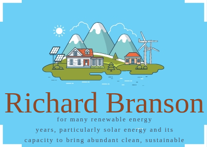

<div align="center">

# **Seeing is Improving: Visual Feedback for Iterative Text Layout Refinement (CVPR 2026)**

</div>

<div align="center">

[](https://arxiv.org/abs/2603.22187)
[](https://github.com/FolSpark/VFLM)
[](https://huggingface.co/collections/FolSpark/vflm)

</div>

We propose **Visual Feedback Layout Model (VFLM)**, a self-improving framework that learns to refine text layouts through iterative visual feedback. Given a background image and text content, VFLM generates SVG layouts, renders intermediate results, observes visual feedback, and improves the layout over multiple refinement turns.

## 🔥 News 

- **Feb. 2026:** VFLM is accepted to CVPR 2026.
- **Mar. 2026:** Released training code.
- **Mar. 2026:** Released VFLM models.
- **Mar. 2026:** Released Text Layout Reward Model.

## Gallery

<table>
  <tr>
    <td align="center"></td>
    <td align="center"></td>
    <td align="center"></td>
    <td align="center"></td>
  </tr>
  <tr>
    <td align="center"></td>
    <td align="center"></td>
    <td align="center"></td>
    <td align="center"></td>
  </tr>
</table>

## Installation

```bash
conda create -n vflm python=3.11
pip install torch==2.5.1 --index-url https://download.pytorch.org/whl/cu121
pip install transformers==4.50.0
pip install vllm==0.7.3 ray
pip install flash-attn --no-build-isolation
pip install -e ./LLaMA-Factory -e ./verl  # For LF and verl integration
```

## Training

### 1. Supervised Fine-Tuning

Run from `LLaMA-Factory/`:

```bash
cd LLaMA-Factory

# Basic SVG layout SFT.
bash scripts/train/run_qwen2.5_vl_3b_svg-v3.sh

# Iterative visual-feedback SFT.
bash scripts/train/run_qwen2.5_vl_3b_svg_rethink_multi_mask.sh
```

For 7B multi-node SFT, edit `main_process_ip`, `machine_rank`, GPU count, model path, data path, and W&B settings, then launch the companion scripts on each node:

```bash
bash scripts/train/run_qwen2.5_vl_7b_svg_nothink_mp0.sh  # node 0
bash scripts/train/run_qwen2.5_vl_7b_svg_nothink_mp1.sh  # node 1
```

### 2. Reward Model Training

Run from `LLaMA-Factory/`:

```bash
cd LLaMA-Factory
bash scripts/train/run_rm_qwen2.5_vl_3b.sh
```

This trains an image-conditioned layout reward model using the `rm_image` stage and pairwise ranking data.

### 3. Reinforcement Learning

Run from `verl/`. Start Ray first if your setup uses a persistent Ray cluster:

```bash
cd verl
bash scripts/train/rl/ray_start.sh
```

Then choose the RL recipe:

```bash
# VFLM with visual-feedback tool calls.
bash scripts/train/rl/run_qwen2.5_vl_7b_svg_w_tool_only_result.sh

# Thinking-style RL without external tool calls.
bash scripts/train/rl/run_qwen2.5_vl_7b_svg_thinking_mp.sh

# Direct no-thinking layout RL.
bash scripts/train/rl/run_qwen2.5_vl_7b_svg_wo_think_mp.sh
```

## Inference

The main inference script expects an OpenAI-compatible chat-completions API endpoint. You can serve a released VFLM checkpoint with vLLM, SGLang, or another OpenAI-compatible backend, then run:

```bash
python infer_mymodel_format_v3.py \
  --api_url http://127.0.0.1:30091/v1 \
  --api_key EMPTY \
  --save_path outputs/VFLM \
  --num_workers 16
```

## Reward Model Serving

`RewardModel/` provides a FastAPI reward model service and a lightweight manager that forwards requests to multiple reward-model instances and augments results with OCR-based metrics.

1. Edit `RewardModel/rm_fastapi.py` and set:

```python
MODEL_PATH = "/path/to/your/reward-model"
```

2. Edit `RewardModel/fastapi_start_serve.sh` for local GPU ids, ports, and number of instances.

3. Start and stop the reward-model service:

```bash
cd RewardModel
bash fastapi_start_serve.sh
bash fastapi_stop_serve.sh
```

4. If you use the manager, edit `RewardModel/rm_server_manager_ocr.py` to replace the default server URLs and OCR URLs with your local endpoints, then run:

```bash
python rm_server_manager_ocr.py
```

## Citation

```bibtex
@article{guo2026seeing,
  title={Seeing is Improving: Visual Feedback for Iterative Text Layout Refinement},
  author={Guo, Junrong and Fang, Shancheng and Qu, Yadong and Xie, Hongtao},
  journal={arXiv preprint arXiv:2603.22187},
  year={2026}
}
```
